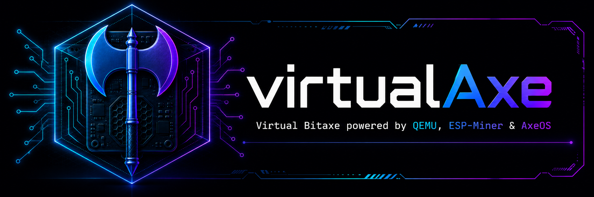
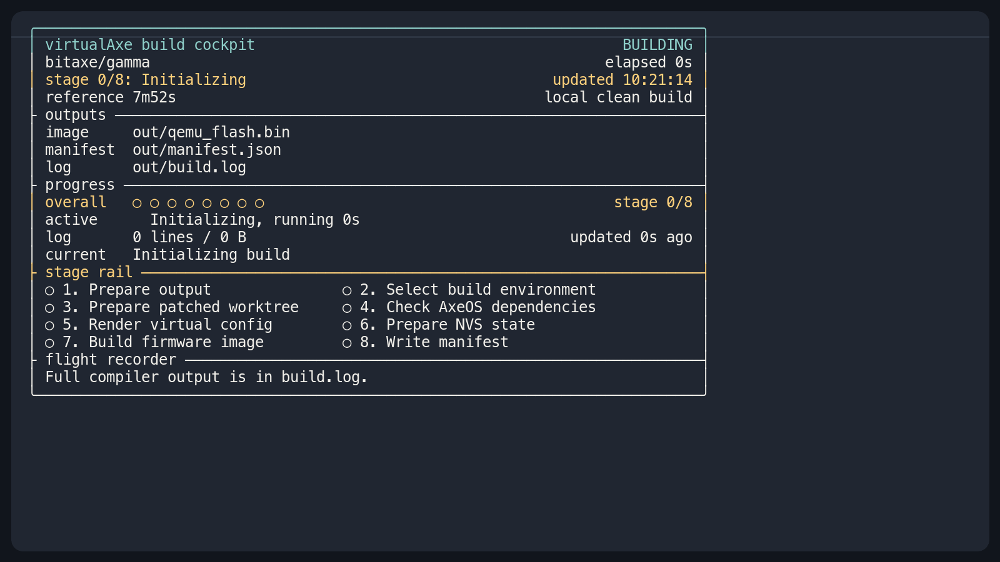

<p align="center">
  
</p>

<p align="center">
  <a href="#quick-start">Quick Start</a>
  ·
  <a href="#what-it-does">What It Does</a>
  ·
  <a href="#supported-sources">Sources</a>
  ·
  <a href="docs/command-contract.md">Commands</a>
  ·
  <a href="docs/architecture.md">Architecture</a>
  ·
  <a href="AGENTS.md">Agent Guide</a>
  ·
  <a href="LICENSE">MIT License</a>
</p>

# virtualAxe

Virtual Bitaxe firmware testing for ESP-Miner, AxeOS, and ESP32-S3 QEMU.

`virtualAxe` builds reusable QEMU firmware images from pinned upstream sources,
including [bitaxeorg/ESP-Miner](https://github.com/bitaxeorg/ESP-Miner), boots
the real AxeOS web UI locally, and keeps mining behavior inside the guest
firmware through a virtual ASIC path.

Use it to test AxeOS, ESP-Miner settings, NVS persistence, Stratum pool flows,
and firmware integrations without keeping physical hardware on the desk.

It is not profitable mining hardware, and it does not replace final validation
on a physical Bitaxe.

## Quick Start

Prerequisites:

- Linux or macOS. WSL2 may work, but is best-effort and not release-qualified.
- Python 3.12 or newer.
- Git.
- Docker or Podman, unless you already have a native ESP-IDF and QEMU toolchain.

Clone the repository and start the default Bitaxe source:

```sh
git clone https://github.com/mars-llm/virtualAxe.git
cd virtualAxe
./vaxe --source bitaxe
```

The first run fetches the pinned upstream source, prepares the patched worktree,
installs missing AxeOS frontend dependencies, builds the reusable QEMU flash
image, starts QEMU, and opens the local dashboard. Later runs reuse the matching
image when the manifest still matches the selected source/profile.

The first build can take several minutes. The terminal build cockpit shows the
active stage, elapsed time, reusable image path, manifest path, full log path,
and local reference timings (`bitaxe`: `7m52s`, `nerdnos`: `4m04s`) so the build
does not look stalled.

Open AxeOS from the dashboard, or use:

```text
http://127.0.0.1:18080
```

Build a reusable image without starting QEMU:

```sh
make build SOURCE=bitaxe
make build SOURCE=nerdnos
```

Successful builds print the image path, manifest path, boot command, replay
command, and rebuild command. The terminal cockpit below is the current build
flow, ending at the real Bitaxe AxeOS UI.



Use the NerdNos source:

```sh
./vaxe --source nerdnos
```

Verify a built image without live pools:

```sh
make verify-submit-replay SOURCE=bitaxe
make verify-submit-replay SOURCE=nerdnos
```

On macOS, Docker Desktop must be running. If you use Podman, an existing Podman
machine must be available; virtualAxe can start it, but will not create or
recreate it. WSL2 with Docker or Podman integration is best-effort only. Native
Windows shells are not part of the tested release matrix.

## What It Does

- Fetches upstream ESP-Miner or NerdNos source into ignored local state.
- Applies the virtual Gamma patch stack in a disposable worktree.
- Builds a reusable ESP32-S3 QEMU flash image:
  - `out/qemu_flash.bin`
  - `out/nerdnos/gamma/qemu_flash.bin`
- Runs real AxeOS/API/NVS behavior from patched upstream firmware.
- Keeps virtual ASIC nonce search and Stratum submit behavior guest-side.
- Provides deterministic local validation for CI/CD and security-test workflows.
- Optional live pool evidence for release checks.
- Does not vendor upstream firmware source into this repository.

## Common Commands

| Command | Use |
| --- | --- |
| `./vaxe` | Print usage and examples without starting QEMU. |
| `./vaxe --source bitaxe` | Run the default Bitaxe ESP-Miner source explicitly. |
| `./vaxe --source nerdnos` | Run the NerdNos source with the same virtual Gamma profile. |
| `make build SOURCE=bitaxe` | Build the default reusable QEMU image without starting QEMU. |
| `make build SOURCE=nerdnos` | Build the NerdNos reusable QEMU image without starting QEMU. |
| `make verify-submit-replay SOURCE=bitaxe` | Deterministic local submit replay for the Bitaxe source. |
| `make verify-submit-replay SOURCE=nerdnos` | Deterministic local submit replay for the NerdNos source. |
| `make validate` | Run the deterministic local validation gate. |

Patch, drift, release, and cleanup commands are documented in
[`docs/command-contract.md`](docs/command-contract.md).

## Supported Sources

| Alias | Upstream | Ref | Profile | Status |
| --- | --- | --- | --- | --- |
| `bitaxe` | [bitaxeorg/ESP-Miner](https://github.com/bitaxeorg/ESP-Miner) | `ce44b2bbfef60ef8830ab17b321cc295e0c0edc8` | `gamma` | `live_verified`: default source. Build, API boot, deterministic submit replay, and live accepted-share evidence pass. |
| `nerdnos` | [shufps/ESP-Miner-NerdQAxePlus](https://github.com/shufps/ESP-Miner-NerdQAxePlus) | `v1.0.37` / `c18abafebde66c39f4bd8ae6d839088b84b4e79c` | `gamma` | `live_verified`: additional source. Build, API boot, deterministic submit replay, and live accepted-share evidence pass. |

`bitaxe` and `nerdnos` select firmware source only. `gamma` remains the only
virtual hardware profile. NerdNos support is source-specific and scoped to the
validation gates above. virtualAxe does not claim full NerdNos feature parity or
hardware-equivalent validation.

## Evidence Model

Local validation does not contact live pools:

```sh
make validate
make verify-submit-replay SOURCE=bitaxe
make verify-submit-replay SOURCE=nerdnos
```

Live release evidence requires five pool-side accepted shares per pool and no
rejected-share delta violation. Pool-side proof can come from a direct remote
pool Stratum accepted response to a current-phase `mining.submit`, or from a
worker-bound pool stats counter when a pool exposes one.

The automated live gate targets Bitronics and Nerdminers. PublicPool remains an
optional runtime preset, but its public instances are not release quality gates.

Firmware/API counters, best-difficulty charts, worker-active status, screenshots,
and generic QEMU log activity are diagnostics only. QEMU logs are accepted only
as the transport for validated live pool Stratum responses.

The seeded pool user is the mandatory public test address used by automated
smoke/release validation:

```text
1A1zP1eP5QGefi2DMPTfTL5SLmv7DivfNa
```

For personal pool runs, replace it in AxeOS or `.env` with your own pool user or
wallet if that pool requires one.

## Simulation Actions

Simulation Actions are optional UI/operator-flow controls:

```sh
./vaxe --source bitaxe --sim-actions
./vaxe --source nerdnos --sim-actions
```

They expose local `/sim/*` endpoints for UI testing. They do not change
hashrate, pool connections, share accounting, Stratum behavior, CPU mining, or
the virtual ASIC submit path. Normal ESP-Miner-compatible API responses do not
include simulator metadata.

## Limits

Use real hardware for electrical behavior, thermal behavior, fan/display/button
behavior, VCORE, Wi-Fi radio behavior, power behavior, ASIC-chain timing, final
performance, and final efficiency validation.

Upstream ESP-Miner and NerdNos sources are fetched separately and are not
vendored here. Upstream projects remain under their own licenses. Screenshots
and documentation in this repository describe virtualAxe integration only; they
do not imply ownership of upstream projects, logos, or firmware source.

virtualAxe-owned code, scripts, tests, patches, screenshots, and documentation
are [MIT licensed](LICENSE).

## Docs

- [`AGENTS.md`](AGENTS.md) - repository boundaries and operating rules for
  coding agents
- [`docs/command-contract.md`](docs/command-contract.md) - command side effects
  and release gates
- [`docs/architecture.md`](docs/architecture.md) - runtime architecture and
  evidence boundaries
- [`docs/patch-stack.md`](docs/patch-stack.md) - active patch list, keep reasons,
  and verification methods
- [`docs/upstream-integration.md`](docs/upstream-integration.md) - source pins,
  patch-check, and drift workflow
- [`docs/debugging.md`](docs/debugging.md) - local debugging notes
- [`docs/known-limitations.md`](docs/known-limitations.md) - platform and
  validation limits
